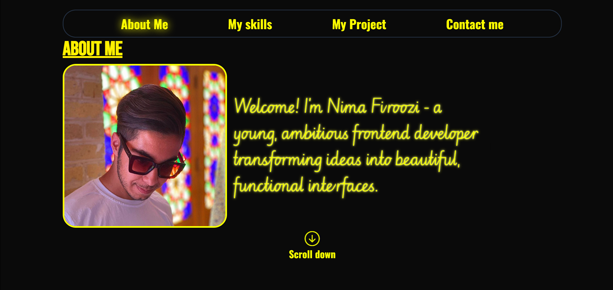
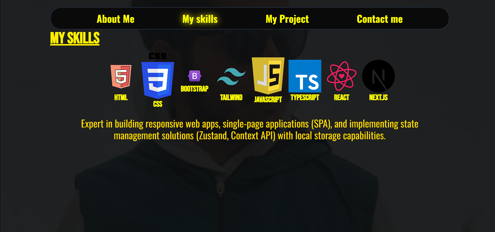
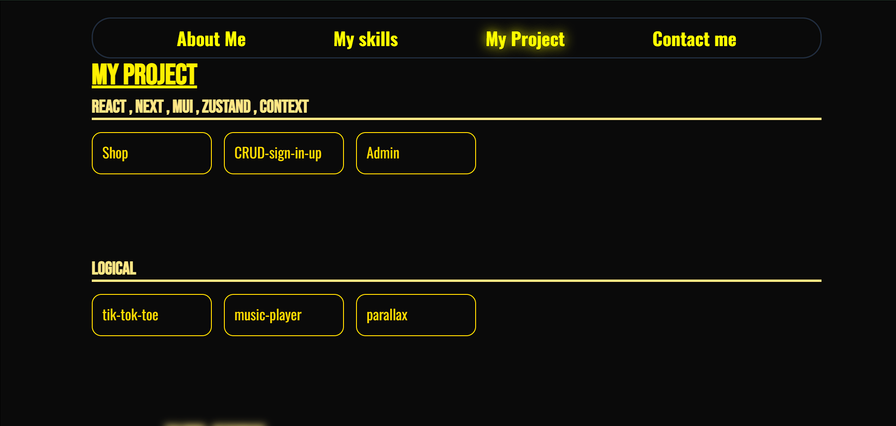
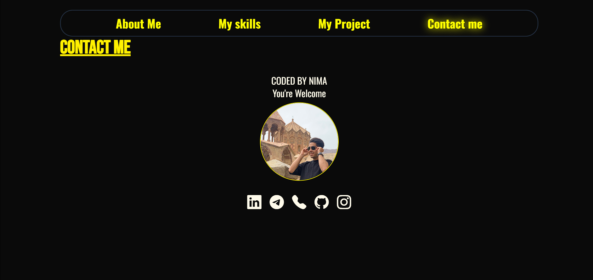

# 
🎨 Portfolio

  
  
  

# ONLINE DEMO

## ✨ Key Features

- 🎨 **Modern Design**: Beautiful and professional design with Tailwind CSS
- ✨ **Advanced Animations**: Smooth and engaging animations with GSAP
- 📱 **Fully Responsive**: Perfect display on all devices

## 🛠️ Tech Stack

- **Main Language**: JavaScript (ES6+)
- **Animations**: GSAP (GreenSock Animation Platform)
- **Styling**: Tailwind CSS

 # SCREEN-SHOT

